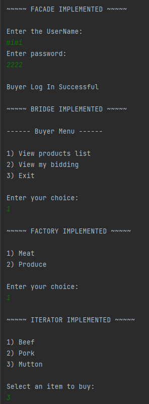
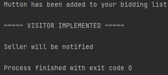
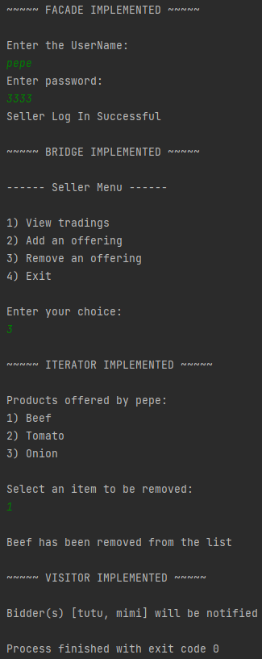

## ASSIGNMENT - DESIGN PATTERN ##
### Buyer/Seller Trading Application ##
### Running the application ###
1. Clone the repo https://github.com/akskola/SER515-Fall22-IndividualRepo.git
2. Open the folder as an IntelliJ project
3. Locate `Main.java` file and run it
4. You will be prompted to enter the `username` and `password` in the command line
5. Enter the credentials and follow the instructions displayed on the screen

**Note:** If you want to change the test cases, make changes to the files present in `textFiles` folder

### Sample output ###
**_For Buyer (mimi/2222):_**

**_For Seller (pepe/3333):_**

